# CADASTRAMENTO_DE_PRODUTO_E_ENVIO_DE_E-MAIL
Uso de Django para cadastramento de produto e envio de e-mail

- Este projeto consiste em um teste de cadastramento de produto e uma simulação de envio de e-mail em um servidor localhost. Os produtos serão salvos em um Banco de Dados (MySQL).

- Na pagina principal é apresentada a lista de produtos cadastrados, porem caso não haja produtos cadastrados no Banco de Dados, será apresentado uma mensagem na tela.

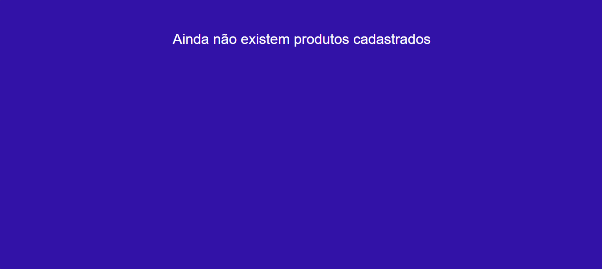

- O projeto consiste em 4 paginas:
   - Pagina principal: http://127.0.0.1:8000/
   - Pagina de contato: http://127.0.0.1:8000/contato/
   - Pagina de produto: http://127.0.0.1:8000/produto/
   - Pagina de administrativa: http://127.0.0.1:8000/admin/

- Pagina principal apresenta uma lista de produtos cadastrados:
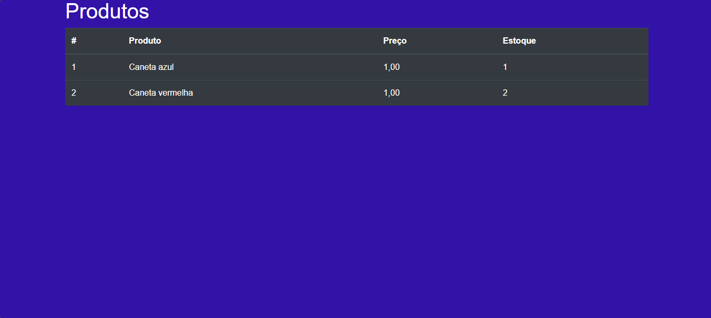

- Os produtos cadastrados carregam com sigo uma imagem do produto, que pode ser visualizado ao clicar em seu nome:
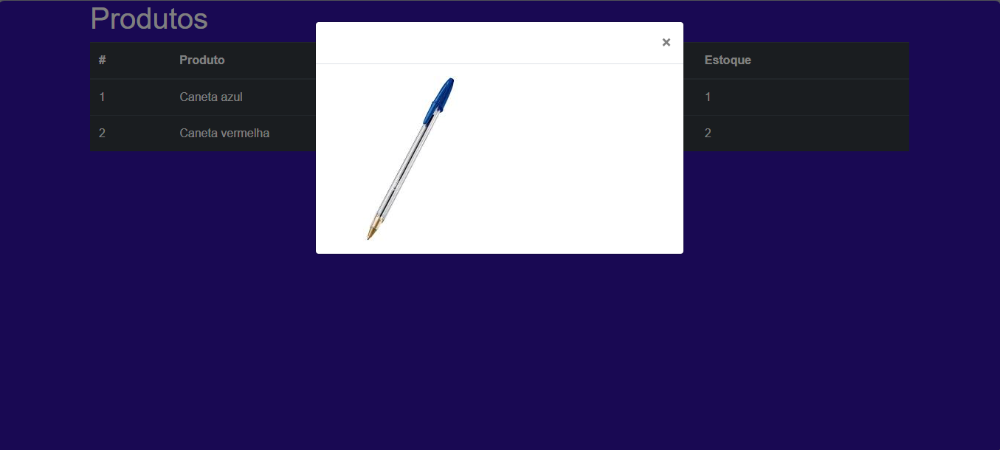

- Pagina de contato é possível simular envio de e-mail:
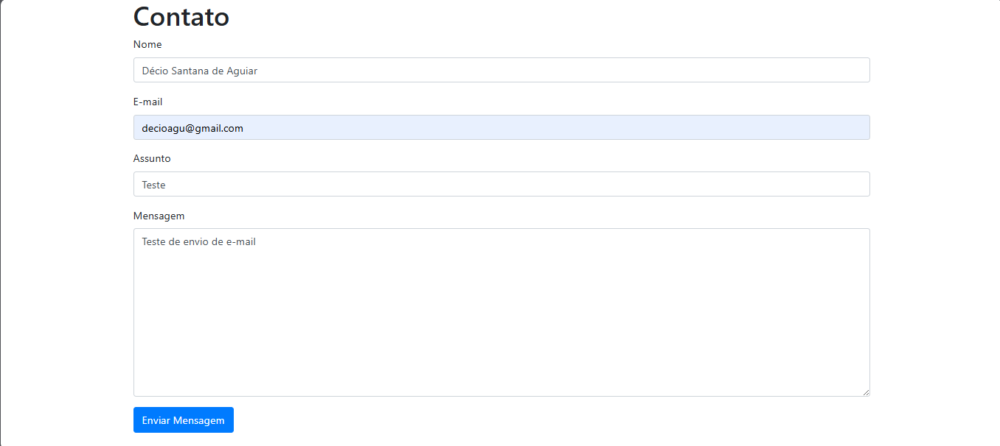

- No terminal terminal é possível acompanhar a simulação do envio de e-mail:
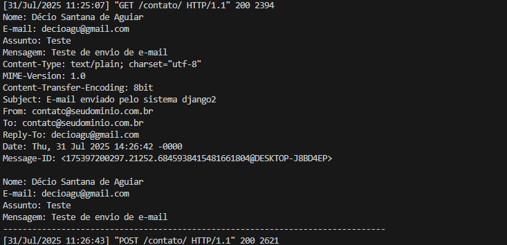

- Pagina de produto é responsável por cadastramento de um produto no Banco de Dados, porem possui uma restrição para usuários cadastrado:
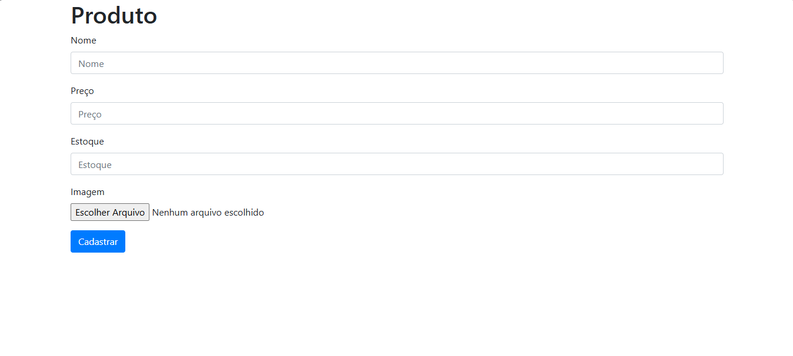

- Pagina administrativa é uma interface web pronta que o Django cria automaticamente capaz de gerenciar elementos da aplicação:
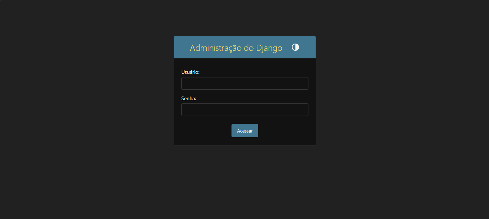

- Use login e senha já cadastrada para ter acesso ao área administrativa do Django:
    - Usuário: decio
    - Senha: dsa

- Área administrativa do Django:
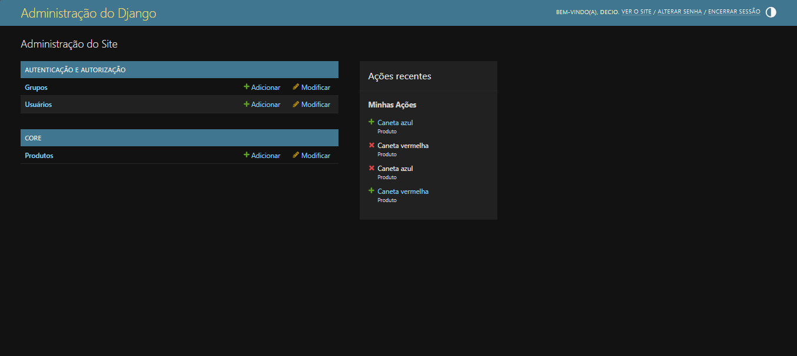

- Apos acesso área administrativa é possível o acesso a pagina do produto http://127.0.0.1:8000/produto/

- Ainda na área administrativa é possível:

- Criar usuários com diferentes nível em hierarquia:
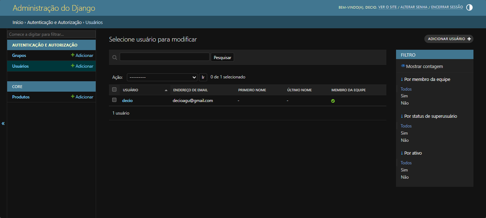

- Criar grupo de usuários com diferentes permissões de nível em hierarquia:
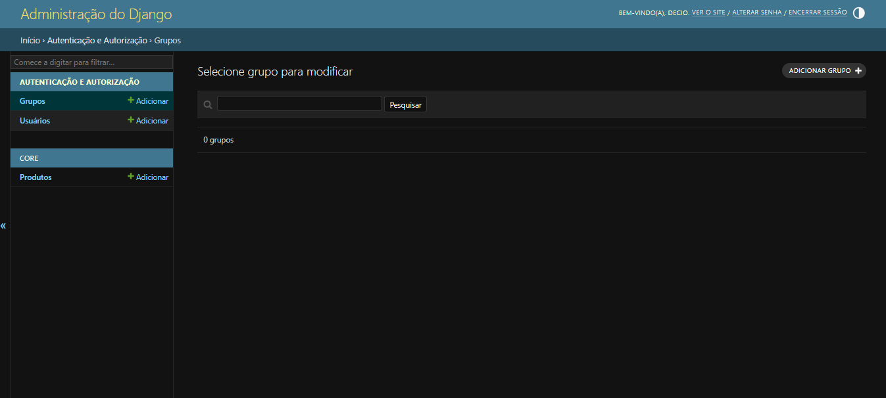

- Visualizar, criar, editar, excluir produtos no Banco de Dados:
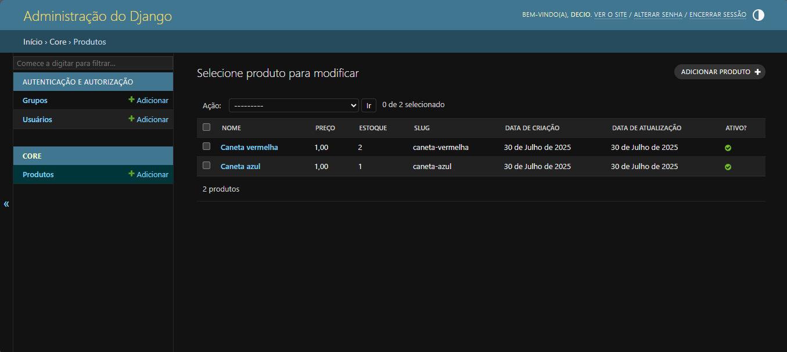

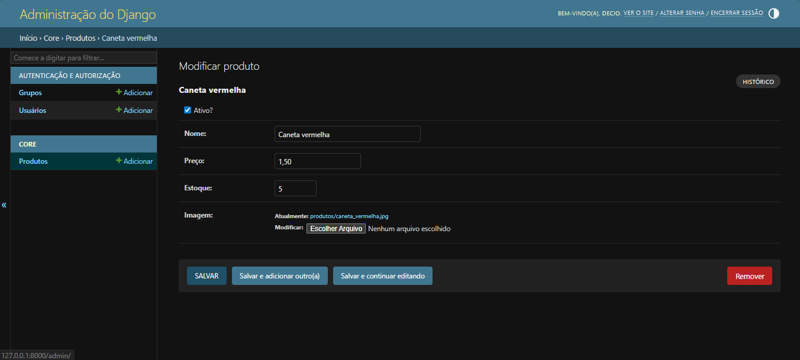

- Roteiro de construção:

- pip install django whitenoise gunicorn django-bootstrap4 mysqlclient django-stdimage python-dotenv

    - django: Framework web de alto nível para desenvolvimento rápido de aplicações web seguras e escaláveis.

    - whitenoise: Middleware para servir arquivos estáticos diretamente no próprio Django (útil em produção).

    - gunicorn: Servidor HTTP WSGI para aplicações Python (como Django).

    - django-bootstrap4: Biblioteca que facilita a integração do framework Bootstrap 4 com templates do Django.

    - mysqlclient: Driver que permite ao Django (e outros apps Python) se conectar a bancos de dados MySQL/MariaDB.

    - django-stdimage : Extensão do campo ImageField do Django com recursos avançados para imagens.

    - python-dotenv: Uma biblioteca do Python que facilita o gerenciamento de variáveis de ambiente em um projeto.

- Roteiro para criação de projeto e aplicação Django:
    - django-admin startproject projeto_02 .
    - django-admin startapp core 

- Criar Banco de Dados em __MySQL__ em "__Mysql Workbench__":
    - SQL:
        CREATE DATABASE projeto_02
        DEFAULT CHARACTER SET utf8
        DEFAULT COLLATE utf8_general_ci;

- Após modelagem do Banco de Dados em "__models.py__" aplicar comando para criar scripts de migração: 
    - python manage.py makemigrations

- Aplica as mudanças no Banco de Dados com:
    - python manage.py migrate

- Criar um usuário administrador (superusuário) do sistema para acesso a rota Django admin:
    - python manage.py createsuperuser

- Iniciar execução do Django dentro da pasta do projeto:
    - python manage.py runserver

Arquivo:
    - core:
        - migrations:
            - __0001_initial.py__: Modelagem automática após __models.py__
        - static:
            - css:
                - __styles.css__: Adição de estilo Paginas HTML
            - images:
            - js:      
        - templates:
            - __index.html__: Pagina HTML (conexão __arquivos estáticos__ e __views.py__)
            - __contato.html__: Pagina HTML (conexão __arquivos estáticos__ e __views.py__)
            - __produto.html__: Pagina HTML (conexão __arquivos estáticos__ e __views.py__)
        - __forms.py__: Aplicação da biblioteca "EmailMessage" envio de e-mail
        - __admin.py__: Manipulação de registros no Banco de Dados "Django admin"
        - __models.py__: Modelagem tabela do Banco de Dados
        - __forms.py__: Formulário para Pagina HTML de envio automático de e-mail (__models.py__)
        - __views.py__: Conexão entre Pagina HTML e Banco de Dados (__models.py__)
    - projeto:
        - __settings.py__: Configurações Django
        - __urls.py__: Adição de rotas requisições __views.py__ para templates (Paginas HTML)
    - __.env__: Variáveis de ambiente (dados sensíveis)

- OBS: __arquivos estáticos__ (static) são quaisquer elementos CSS, JavaScript e imagens ou documentos.
